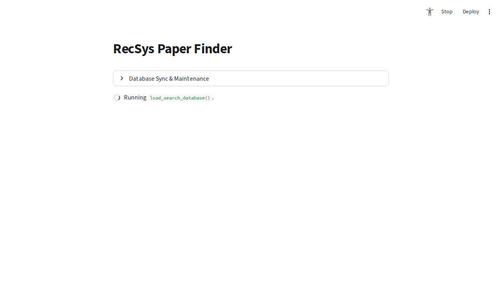
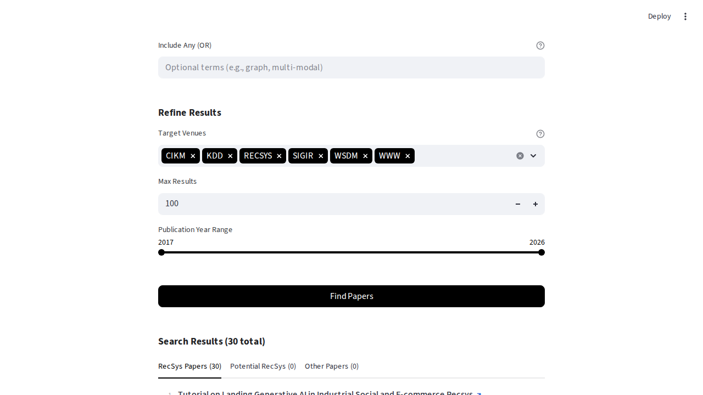

# RecSys Paper Finder

RecSys Paper Finder는 학술 논문을 쉽게 검색하고 필터링할 수 있도록 설계된 공개, 비상업적 프로젝트입니다. 특히 추천 시스템(RecSys) 분야에 중점을 두고 있습니다.

라이브 배포 링크: https://recsys-paper-finder.streamlit.app/

사용자는 자신의 BibTeX(.bib) 파일을 사용하여 데이터베이스를 구축하고, 자연어 처리를 활용하여 키워드 기반 및 랭킹 기반 검색을 수행하여 관련 논문을 찾을 수 있습니다.

## 주요 기능

- 의미론적 발견 및 랭킹: BM25Okapi 알고리즘(BM25)을 사용하여 검색 쿼리의 관련성에 따라 논문을 효과적으로 랭킹을 매깁니다.
- 키워드 필터링: 특정 키워드에 대한 엄격한 일치(AND/OR 필터링 논리)를 지원합니다.
- 연도 필터링: 출판 연도를 기준으로 논문 결과를 쉽게 좁힐 수 있습니다.
- 자동 처리: update.py 스크립트는 컨퍼런스 폴더 내의 중첩된 .bib 파일을 자동으로 .csv로 변환하고 중앙 데이터베이스를 업데이트합니다.
- 추천 시스템 집중: 도메인 특화 키워드 휴리스틱을 사용하여 검색 결과를 "추천 시스템 논문"과 "기타 논문"으로 자동 분류합니다.
- 분석 뷰: Altair를 사용하여 컨퍼런스 및 출판 연도별로 라이브러리를 시각화합니다.

## UI 소개

프로젝트의 사용자 인터페이스는 크게 다음과 같이 구성됩니다.

### 1. 메인 화면 및 데이터베이스 동기화



앱을 실행하면 가장 먼저 "데이터베이스 동기화 및 유지 관리(Database Sync & Maintenance)" 옵션이 보입니다.
이 섹션을 통해 최신 BibTeX 파일들을 바탕으로 논문 데이터베이스를 손쉽게 업데이트할 수 있습니다.

### 2. 검색 및 결과 화면



검색 전략 정의(Define Search Strategy) 영역에서 다음 세 가지 기본 검색 방식을 선택할 수 있습니다.
- 의미론적 발견 (BM25)
- 특정 키워드 (Exact)
- 연구자 검색 (Author)

또한 "결과 세분화(Refine Results)" 영역을 통해 특정 컨퍼런스나 출판 연도 범위를 지정하여 결과를 좁힐 수 있습니다.
검색 결과는 "RecSys Papers", "Potential RecSys", "Other Papers" 탭으로 나뉘어 표시되며, 사용자는 관심 있는 논문 목록을 빠르게 확인할 수 있습니다.

## 프로젝트 구조

```text
recsys-paper-finder/
├── app.py                      # 메인 Streamlit 웹 애플리케이션
├── update.py                   # bibtex 파일을 처리하고 검색 데이터베이스를 구축하는 스크립트
├── requirements.txt            # Python 의존성 패키지 목록
├── bibtex/                     # [사용자 입력] 원본 .bib 파일을 저장하는 디렉토리
├── papers/                     # [자동 생성] 변환된 .csv 파일이 저장되는 디렉토리
└── paper_database.parquet      # [자동 생성] 처리된 모든 논문의 컴파일된 데이터베이스
```

## 설정 및 설치

**1. 저장소 클론 및 폴더 이동**
```bash
git clone https://github.com/yourusername/recsys-paper-finder.git
cd recsys-paper-finder
```

**2. 의존성 설치**
Python 3.8 이상이 설치되어 있는지 확인합니다. 그런 다음 필요한 패키지를 설치합니다.
```bash
pip install -r requirements.txt
```

## 사용 방법

### 1. BibTeX 파일 추가
컨퍼런스/저널을 나타내는 `bibtex/` 아래에 디렉토리 구조를 만들고 거기에 `.bib` 파일을 배치합니다. 예시:
```text
bibtex/
  ├── sigir/
  │   └── sigir_2023.bib
  ├── kdd/
  │   └── 2022/
  │       └── kdd_2022.bib
```
참고: 스크립트는 `.bib` 파일이 얼마나 깊게 중첩되어 있는지에 관계없이 `bibtex/` 아래의 첫 번째 수준 폴더 이름(예: "sigir", "kdd")을 컨퍼런스/책 제목 이름으로 자동 사용합니다.

### 2. 데이터베이스 구축
업데이트 스크립트를 실행하여 BibTeX 파일을 구문 분석하고 CSV 형식으로 변환한 다음 데이터베이스를 구축합니다.
```bash
python update.py
```
오류가 발생하거나 처음부터 전체 데이터베이스를 다시 구축하려면 `--force` 플래그를 사용합니다.
```bash
python update.py --force
```

### 3. 앱 실행
Streamlit 인터페이스를 시작합니다.
```bash
streamlit run app.py
```
그러면 웹 브라우저(일반적으로 `http://localhost:8501`)에서 사용자 인터페이스가 열립니다.

## 의존성
- `streamlit` - 웹 인터페이스용.
- `pandas` & `pyarrow` - 데이터 처리 및 `.parquet` 파일 저장용.
- `rank_bm25` - BM25Okapi 검색 랭킹 알고리즘용.
- `altair` - 논문 수 측정항목 시각화용.
- `bibtexparser` - `.bib` 파일 구문 분석용.